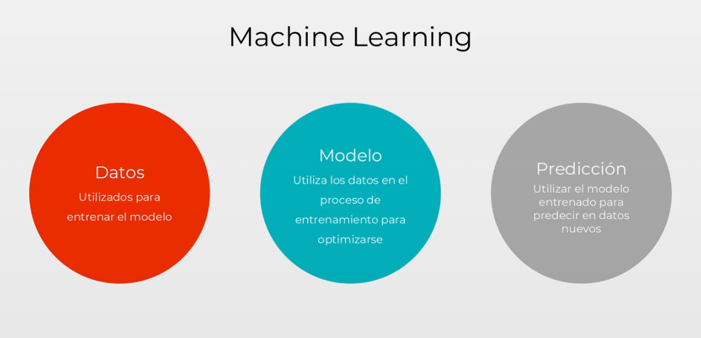
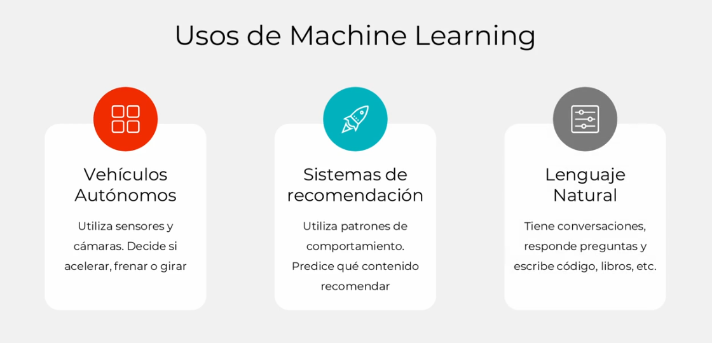

## ¿Qué es Machine Learning?
Son modelos que se alimentan de una gran cantidad de datos de entrenamiento para que aprendan cierto patrón o comportamiento, y se ajusten poco a poco para finalmente, por ejemplo, hacer predicciones de datos que no haya visto.
Un ejemplo claro puede ser un clasificador de imagenes donde el modelo sea capaz de diferenciar cuando la imagen contiene un gato o un perro.

## Posibilidades del Machine Learning

