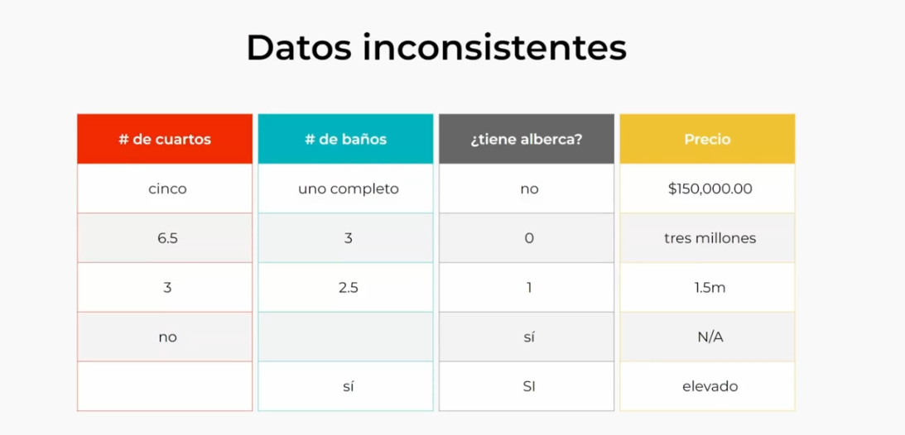
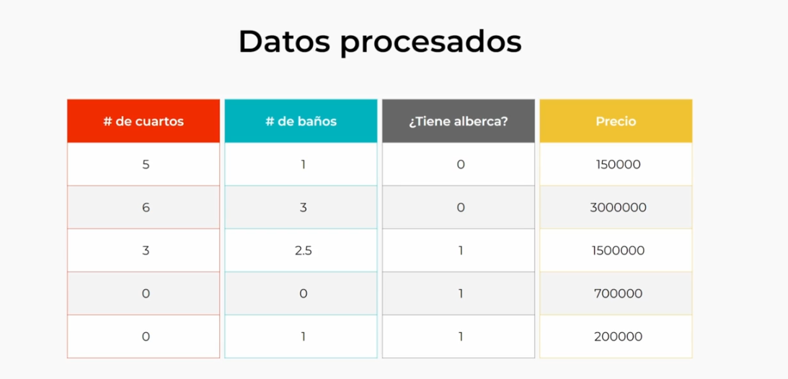
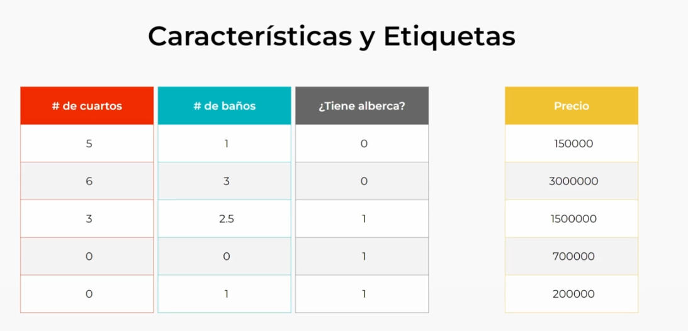

## Tipos y ejemplos de Machine Learning
- Aprendizaje supervisado
    - Ejemplo: Predicción de precio de casas
        - Datos etiquetados: # baños, # cuartos, tamaño (m2), tiene alberca?.
    - Modelos de regresión: predecir un dato numérico contínuo.
    - Modelos de clasificación: predecir la categoría correcta.
- Aprendizaje no supervisado
    - Ejemplo: Segmentación de clientes
        - Agrupar en función del comportamiento específico de cada grupo.
- Aprendizaje por refuerzo
    - Ejemplo: Agente que aprende a jugar Ajedrez.
        - Cada acción cambia el ambiente dando retroalimentación constante.

## Los datos: la base de cualquier modelo
Los datos son el corazón (base) de cualquier modelo de Machine Learning.

Malos datos = Modelo mal entrenado y resultados malos
Buenos datos = Buenos modelos y buenos resultados (predicciones)

**NO es lo mismo tener muchos datos, que datos de calidad.**

### Obtención
Se pueden obtener de distintas fuentes, como:
- Bases de datos
- Repositorios
- Datos en tiempo real
- Datos generados por usuarios (aplicaciones/sitios web)

### Limpieza
Para poder usar los datos se necesitan limpiar (datos faltantes, formato), eliminar duplicados, etc.

### Identificar características
Definir características relevantes para las predicciones que queremos realizar.

Debemos evitar datos irrelevantes que no son de importancia para nuestras predicciones y para que el modelo no busque patrones innecesarios.

Finalmente se separan los datos en dos conjuntos: entrenamiento (80%) y pruebas (20%), el primero para entrenar el modelo y el segundo para evaluar que tan bien entrenado está el modelo.

